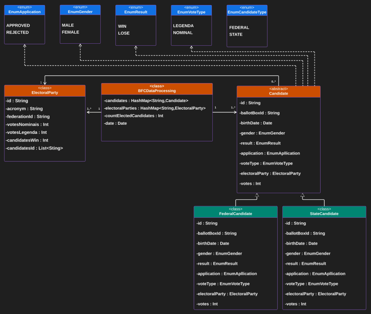
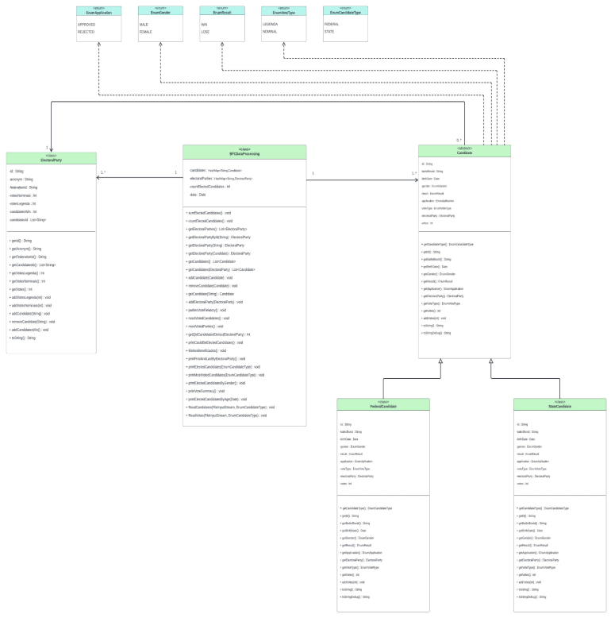

## Brazilian Federal Court Data Processing

### General Description:
The code provides a Java (and also c++) implementation for processing election data related to the Brazilian Federal Court (BFC). It includes class definitions for federal and state candidates, political parties, and the main class for data processing.

### Folder and File Structure:

1. **Candidate Folder:**
   - `Candidate.java`: Abstract class representing a generic candidate.
   - `FederalCandidate.java`: Subclass of `Candidate` specific to federal candidates.
   - `StateCandidate.java`: Subclass of `Candidate` specific to state candidates.

2. **ElectoralParty Folder:**
   - `ElectoralParty.java`: Class representing a political party.

3. **Bfc Folder:**
   - `Bfc.java`: Main class for data processing, including methods for analyzing election results.

### Candidate Class (Candidate.java):

#### Attributes:
- `id`: Candidate number.
- `ballotBoxId`: Candidate's ballot box name.
- `birthDate`: Candidate's birth date.
- `gender`: Candidate's gender.
- `result`: Candidate's election result (WIN or LOSE).
- `application`: Candidate's election status (APPROVED or REJECTED).
- `voteType`: Vote type (NOMINAL or LEGENDA).
- `electoralParty`: Candidate's political party.
- `votes`: Number of votes for the candidate.

#### Main Methods:
- `getCandidateType()`: Returns the candidate type (Federal or State).
- `addVotes(int votes)`: Adds votes to the candidate.

#### Auxiliary Methods:
- `toString()`: String representation of the candidate for display.
- `toStringDebug()`: String representation of the candidate for debugging.

### FederalCandidate and StateCandidate Classes:

- Extend the `Candidate` class and implement the `getCandidateType()` method to return the specific type of candidate (Federal or State).

### ElectoralParty Class (ElectoralParty.java):

#### Attributes:
- `id`: Party number.
- `acronym`: Party acronym.
- `federationId`: Party's federation number.
- `votesNominais`: Party's nominal votes.
- `votesLegenda`: Party's legend votes.
- `candidatesWin`: Number of elected candidates from the party.
- `candidatesId`: List of candidate IDs linked to the party.

#### Main Methods:
- `addVotesLegenda(int votes)`: Adds legend votes to the party.
- `addVotesNominais(int votes)`: Adds nominal votes to the party.
- `addCandidate(String candidateId)`: Adds a candidate to the party.
- `removeCandidate(String candidateId)`: Removes a candidate from the party.
- `addCandidatesWin()`: Increments the number of elected candidates.

#### Auxiliary Methods:
- `toString()`: String representation of the party for display.

### BFCDataProcessing Class (Bfc.java):

#### Attributes:
- `candidates`: Map of candidates by ID.
- `electoralParties`: Map of political parties by ID.
- `countElectedCandidates`: Elected candidates counter.
- `date`: Election date.

#### Main Methods:
- `sumElectedCandidates()`: Increments the elected candidates counter.
- `countElectedCandidates()`: Prints the number of elected candidates.
- `getElectoralParties()`: Returns the list of political parties.
- `getElectoralPartyById(String electoralPartyId)`: Returns a party by ID.
- `getElectoralParty(String candidateId)`: Returns a candidate's party by ID.
- `getElectoralParty(Candidate candidate)`: Returns a candidate's party.
- `getCandidates()`: Returns the list of candidates.
- `getCandidates(ElectoralParty electoralParty)`: Returns the list of candidates from a party.
- `addCandidate(Candidate candidate)`: Adds a candidate.
- `removeCandidate(Candidate candidate)`: Removes a candidate.
- `getCandidate(String candidateId)`: Returns a candidate by ID.
- `addElectoralParty(ElectoralParty electoralParty)`: Adds a political party.
- `partiesVoteRelatory()`: Prints the vote report by party.
- `mostVotedCandidates()`: Prints the most voted candidates.
- `mostVotedParties()`: Prints the most voted parties.
- `getQtdCandidatosEleitos(ElectoralParty p)`: Returns the quantity of elected candidates per party.
- `printCouldBeElectedCandidates()`: Prints candidates who could have been elected.
- `ElectedBeneficiados()`: Prints elected candidates who benefited from the proportional system.
- `printFirstAndLastByState()`: Prints the first and last-placed candidates by state.

### Usage:
- Election data must be provided in a specific format (CSV, for example).
- The code can be integrated into an existing Java project or run as an independent application.

### Example Usage:

```java
public class App {
    public static void main(String[] args) throws Exception {
        EnumCandidateType candidateType = (args[0].compareTo("--federal") == 0)? EnumCandidateType.FEDERAL : EnumCandidateType.STATE;
        String candidateQuery = args[1];
        String votingSection = args[2];
        Date date = new SimpleDateFormat("dd/MM/yyyy").parse(args[3]);
        BFCDataProcessing electoralSystem = new BFCDataProcessing(date);

        try{
            FileInputStream candidatesFile = new FileInputStream(candidateQuery);
            electoralSystem.readCandidates(candidatesFile, candidateType);
            candidatesFile.close();
        }catch(FileNotFoundException fileException){
            System.out.println(fileException.getMessage());
            fileException.printStackTrace();
        }catch(Exception e){
            System.out.println("Arquivo de entrada Candidatos inexistente!");
            e.printStackTrace();
        }

        try{
            FileInputStream votesFile =  new FileInputStream(votingSection);
            electoralSystem.readVotes(votesFile, candidateType);    
            votesFile.close();
        }catch(FileNotFoundException fileException){
            System.out.println(fileException.getMessage());
            fileException.printStackTrace();
        }catch(Exception e){
            System.out.println(e.getMessage());
            e.printStackTrace();
        }

        electoralSystem.countElectedCandidates();
        electoralSystem.printElectedCandidates(candidateType);       
        electoralSystem.printMostVotedCandidates(candidateType);   
        electoralSystem.printCouldBeElectedCandidates();
        electoralSystem.EleitosBeneficiados();
        electoralSystem.mostVotedParties();
        electoralSystem.printFirstAndLastByElectoralParty();
        electoralSystem.printElectedCandidatesByAge(date);
        electoralSystem.printElectedCandidatesByGender();                     
        electoralSystem.printVoteSummary();
    }
}
```

---

## UML Modeling

### Class Diagram:

A class diagram is a visual representation of the static structure and relationships within a system. In the context of the BFC Data Processing system, the class diagram illustrates the essential classes, their attributes, methods, and associations.

#### Simplified Class Diagram:



**Figure 1: Simplified Class Diagram**

- The simplified class diagram provides an overview of the main classes and their relationships. It omits some details for clarity but highlights the essential components of the system.

#### Complete Class Diagram:



**Figure 2: Complete Class Diagram**

- The complete class diagram includes all relevant classes, attributes, methods, and associations, offering a comprehensive view of the BFC Data Processing system's structure.

---

### Notes:
- Ensure to provide election data in the expected format to ensure the correct functioning of the code.
- Read the source code documentation for detailed information about each class and method.

### Info
- This project was made by Gabriel Zuany Duarte Vargas and Lorenzo Rizzi Fiorot in Object Oriented Programming grade in UFES.
- 2023/12
